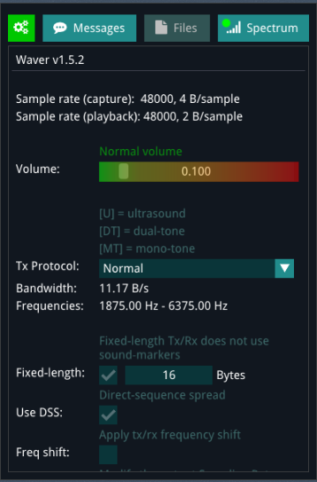
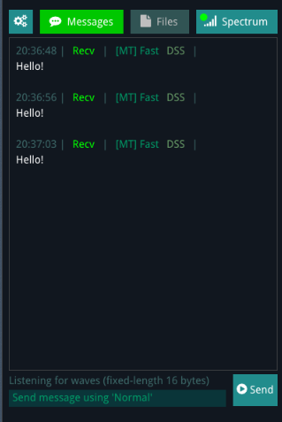

# Gibberlink

# Synthèse technique de l'encodage GGWave

## 1\. Introduction

Ce projet reprend une partie de la technique d'encodage utilisée par **GGWave**, développée à l'origine par **Georgi Gerganov**.

L'objectif est de transformer une petite quantité de données binaires en une suite de **tons audio**, sans générer directement de fichier WAV.

Dans cette implémentation Arduino, le traitement est volontairement simplifié :

```
Texte
  |
  v
Payload fixe
  |
  v
DSS (Data Spread Spectrum)
  |
  v
Reed-Solomon
  |
  v
Codeword
  |
  v
Découpage en nibbles
  |
  v
Suite de tons
```

Le résultat final est une liste de valeurs représentant les tons à transmettre.

Le signal audio peut ensuite être généré directement par l'Arduino, par exemple avec un buzzer(gpio 10), un haut-parleur ou un autre système de génération de signal.

La version logicielle sur rpi pico génère un signal HF sur 7100kHz avec le circuit du projet [wspr-pico](https://github.com/f4goh/wspr-pico)

L'utilisation de Gibbelink dans le domaine radioamateur en HF est purement expérimental. La largeur de bande utilisé est trop large (environ 700Hz).

De plus l'auteur n'as pas inclus de FCS dans son protocole. Le décodage peut alors afficher des erreurs.

---

## 2\. Projet GGWave original

Le projet original est disponible ici :[https://github.com/ggerganov/ggwave](https://github.com/ggerganov/ggwave)


Auteur original :

**Georgi Gerganov**

GGWave est conçu pour transmettre de petites quantités de données à travers un canal audio.

Le projet original possède beaucoup plus de fonctionnalités que cette implémentation Arduino simplifiée, notamment :

- plusieurs protocoles ;
- encodage et décodage audio ;
- génération de waveform ;
- analyse fréquentielle ;
- réception depuis un microphone ;
- correction d'erreurs ;
- plusieurs vitesses de transmission ;
- différents formats audio.

Cette version Arduino ne conserve que la partie nécessaire à la génération des données codées et des tons.

Autre projet de indomptableBar:

-[Le projet git](https://github.com/indomptableBar/gibberlink-talk)

-[Encodeur](https://indomptablebar.github.io/gibberlink-talk/)

-[Decodeur](https://indomptablebar.github.io/gibberlink-talk/decode.html)

---

## 3\. Décodeur en ligne pour le projet Arduino

Un [décodeur](https://waver.ggerganov.com/) permettant de tester les transmissions GGWave est disponible ici :

Il peut être utilisé pour vérifier qu'un signal généré par le projet est correctement interprété.





---

# 4\. Structure générale de l'encodage

L'encodage utilisé dans cette implémentation suit plusieurs étapes.

```
Message texte
     |
     v
Payload
     |
     v
DSS
     |
     v
Reed-Solomon
     |
     v
Codeword
     |
     v
Nibbles de 4 bits
     |
     v
Tons
```

Chaque étape possède un rôle différent.

---

# 5\. Payload

Le message est placé dans un buffer de taille fixe.

Dans notre configuration :

```
MAX_PAYLOAD = 16
```

Le payload peut donc contenir jusqu'à 16 octets.

Par exemple :

```
HELLO
```

devient :

```
48 45 4C 4C 4F
```

puis les octets restants sont remplis avec des zéros si le protocole utilise un payload fixe de 16 octets.

Le format est donc conceptuellement :

```
+-------------------------------+
|          PAYLOAD              |
|                               |
|  16 octets maximum            |
+-------------------------------+
```

---

# 6\. DSS - Data Spread Spectrum

Avant le Reed-Solomon, les données peuvent être mélangées avec une séquence DSS.

La technique utilisée est un XOR entre chaque octet du payload et une table prédéfinie.

Formellement :

```
encoded[i] = payload[i] XOR DSS[i]
```

La table DSS utilisée est une séquence de 64 octets.

Comme le payload est limité à 16 octets, seuls les 16 premiers éléments sont utilisés dans cette configuration.

Exemple :

```
payload[i] = 0x48
DSS[i]     = 0x96

0x48 XOR 0x96 = 0xDE
```

Le DSS permet de modifier la représentation des données avant leur transmission.

---

# 7\. Reed-Solomon

Après le DSS, les données passent dans un code correcteur d'erreurs **Reed-Solomon**.

Dans notre configuration :

```
Payload       = 16 octets
ECC           = 6 octets
Codeword      = 22 octets
```

Donc :

```
16 octets de données
+
6 octets de correction
=
22 octets transmis
```

Le Reed-Solomon permet au récepteur de détecter et de corriger certaines erreurs provoquées par le canal de transmission.

La structure devient :

```
+----------------------+----------------+
|      Payload         |      ECC       |
|      16 octets       |    6 octets    |
+----------------------+----------------+
          22 octets
```

Le code Reed-Solomon utilisé dans le projet est basé sur un corps de Galois GF(256).

---

# 8\. GF(256)

Reed-Solomon travaille sur le corps fini :

```
GF(256)
```

Cela signifie que chaque symbole est représenté par un octet :

```
0 ... 255
```

Les opérations sont effectuées avec l'arithmétique des corps finis.

La multiplication et la division utilisent notamment des tables logarithmiques :

```
exp[]
log[]
```

La primitive utilisée est :

```
0x11D
```

Les tables permettent d'effectuer rapidement les opérations nécessaires au Reed-Solomon.

---

# 9\. Conversion du codeword en tons

Une fois le codeword obtenu, chaque octet est séparé en deux groupes de 4 bits.

Un octet :

```
1010 0111
```

devient :

```
1010
0111
```

soit :

```
0xA
0x7
```

On appelle ces groupes de 4 bits des **nibbles**.

Pour chaque octet :

```
low  = value & 0x0F;
high = value >> 4;
```

Avec 22 octets :

```
22 × 2 = 44 tons
```

Le résultat final contient donc :

```
44 valeurs de ton
```

---

# 10\. Exemple

# Pourquoi 44 tons ?

La liste dans l'exemple **`"Hello!"`** contient **44 valeurs**, ce qui correspond exactement à ce que prévoit l'encodeur actuel.

## Pourquoi 44 tons ?

On a :

- **Payload** = 16 octets
- **Reed-Solomon** = 6 octets ECC
- **Codeword** = 22 octets

Donc :

```
16 + 6 = 22 octets
```

Ensuite, `encodeTones()` transforme chaque octet en **2 nibbles de 4 bits** :

```
m_tones[m_toneCount++] = value & 0x0F;
m_tones[m_toneCount++] = value >> 4;
```

Donc :

```
22 octets × 2 tons = 44 tons
```

La liste obtenue :

```
14 13 10 15 8 13 3 12 4 7 0 11 14 13 5 12
5 4 5 7 8 14 14 2 15 0 2 3 10 4 15 5
13 4 14 5 15 14 11 12 9 15 0 15
```

contient bien **44 tons**.

## Comment lire la liste ?

Il faut regrouper les valeurs **2 par 2** :

```
14 13
10 15
 8 13
 3 12
 4  7
 0 11
14 13
 5 12
 5  4
 5  7
 8 14
14  2
15  0
 2  3
10  4
15  5
13  4
14  5
15 14
11 12
 9 15
 0 15
```

Chaque paire représente un octet du **codeword**.

### Exemple 1

La paire :

```
14 13
```

correspond à :

```
nibble bas  = 14 = 0xE
nibble haut = 13 = 0xD
```

L'octet correspondant est donc :

```
0xDE
```

### Exemple 2

La paire :

```
10 15
```

donne :

```
nibble bas  = 10 = 0xA
nibble haut = 15 = 0xF
```

Donc :

```
0xFA
```

## Le codeword reconstitué

À partir des 44 tons, on obtient :

```
DE FA D8 C3 74 B0 DE C5 45 75 E8 2E 0F 32 4A 5F
4D 5E EF CB F9 F0
```

Soit :

```
22 octets
```

Les **16 premiers octets** correspondent aux données protégées par DSS, tandis que les **6 derniers octets** sont les octets Reed-Solomon.

## Point important : les valeurs 0 à 15 ne sont pas encore des fréquences

Les valeurs :

```
0 ... 15
```

ne représentent pas directement les fréquences audio.

Ce sont des **symboles / indices de tons**.

La prochaine étape consiste donc à transformer chaque indice en une fréquence. Par exemple :

```
14 → fréquence correspondante
13 → autre fréquence
...
```

C'est à ce niveau qu'interviennent notamment :

- `freqStart`
- `hzPerSample`
- la configuration du protocole

L'enchaînement complet est donc :

```
"Hello!"
    ↓
Payload fixe de 16 octets
    ↓
Reed-Solomon (+ 6 octets ECC)
    ↓
Codeword de 22 octets
    ↓
2 nibbles par octet
    ↓
44 tons / symboles
    ↓
Conversion des symboles en fréquences
    ↓
Signal audio
```

Ainsi, le résultat de **44 tons pour****`HELLO!`** est cohérent avec l'architecture actuelle : le texte fait moins de 16 octets, mais le protocole travaille sur un **payload fixe de 16 octets**, puis :

```
16 + 6 = 22 octets
22 × 2 = 44 tons
```


Voici la version Markdown :

:::writing{variant="document" id="74136" title="Synthèse des tonalités pour l'envoi de HELLO!"}

# 11\.Synthèse des tonalités pour l'envoi de `HELLO!`

| Shift (`curTone`) | Fréquence (`freq_hz`) | Type |
| --- | --- | --- |
| 0 | 1125.00 Hz | Base (Min) |
| 2 | 1218.75 Hz | Standard |
| 3 | 1265.63 Hz | Standard |
| 4 | 1312.50 Hz | Standard |
| 5 | 1359.38 Hz | Standard |
| 7 | 1453.13 Hz | Standard |
| 8 | 1500.00 Hz | Standard |
| 9 | 1546.88 Hz | Standard |
| 10 | 1593.75 Hz | Standard |
| 11 | 1640.63 Hz | Standard |
| 12 | 1687.50 Hz | Standard |
| 13 | 1734.38 Hz | Standard |
| 14 | 1781.25 Hz | Standard |
| 15 | 1828.13 Hz | Max |

### Paramètres

- **Total de tonalités émises :** `44`
- **Pas entre chaque shift (****`hzPerSample`****) :** `~46.87 Hz`
- **Fréquence minimale :** `1125.00 Hz`
- **Fréquence maximale :** `1828.13 Hz`

### Formule

La fréquence est déterminée à partir du shift selon :

```
freq_hz = freqStart + (curTone × hzPerSample)
```

avec :

```
freqStart   = 1125.00 Hz
hzPerSample = 46.875 Hz
```

Par exemple, pour `curTone = 14` :

```
1125.00 + (14 × 46.875)
= 1781.25 Hz
```

Et pour `curTone = 15` :

```
1125.00 + (15 × 46.875)
= 1828.125 Hz
≈ 1828.13 Hz
```

---

# 12\. Gestion de la vitesse

La vitesse de transmission est principalement contrôlée par le nombre de frames utilisées pour transmettre un symbole.

Dans notre implémentation, un protocole peut être défini par :

```
struct Protocol {
    uint8_t framesPerByte;
    uint16_t freqStart;
};
```

Exemple :

```
static const GGWave::Protocol SLOW = {
    9,
    24
};

static const GGWave::Protocol NORMAL = {
    6,
    24
};

static const GGWave::Protocol FAST = {
    4,
    24
};

static const GGWave::Protocol FASTEST = {
    3,
    24
};
```

La différence principale est :

```
SLOW       -> 9 frames
NORMAL     -> 6 frames
FAST       -> 4 frames
FASTEST    -> 3 frames
```

Plus le nombre de frames est faible, plus la transmission est rapide.

---

# 13\. Durée d'un ton

La durée d'un ton dépend de trois paramètres :

```
framesPerByte
samplesPerFrame
sampleRate
```

La formule utilisée est :

```
durée = framesPerByte × samplesPerFrame / sampleRate
```

En millisecondes :

```
durée_ms =
    framesPerByte × samplesPerFrame × 1000
    -----------------------------------------
                 sampleRate
```

Exemple :

```
framesPerByte = 3
samplesPerFrame = 128
sampleRate = 6000 Hz
```

donne :

```
3 × 128 × 1000 / 6000
= 64 ms
```

Le même protocole avec 9 frames donnerait :

```
9 × 128 × 1000 / 6000
= 192 ms
```

---

# 14\. Compromis vitesse / fiabilité

Augmenter la vitesse n'est pas forcément meilleur.

Une transmission plus rapide signifie une durée de ton plus courte.

Cela peut rendre le décodage plus difficile en présence :

- de bruit ;
- de réverbération ;
- de haut-parleurs de mauvaise qualité ;
- de microphones de mauvaise qualité ;
- de variation du volume ;
- de décalage de fréquence ;
- de perturbations extérieures.

On peut donc définir plusieurs modes :

```
SLOW
  |
  | meilleure robustesse
  |
NORMAL
  |
FAST
  |
FASTEST
  |
  +---- meilleure vitesse
```

Le choix du protocole peut alors être fait directement dans le `.ino`.

---

# 15\. Architecture orientée objet

L'implémentation Arduino utilise une classe :

```
GGWave
```


